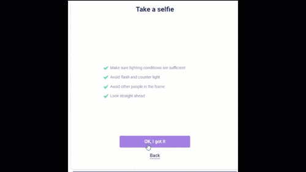
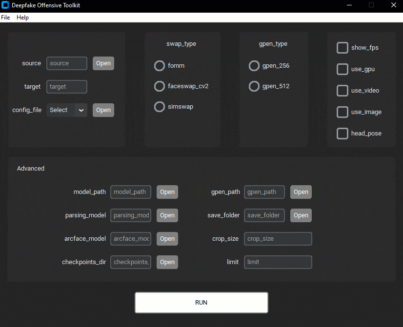
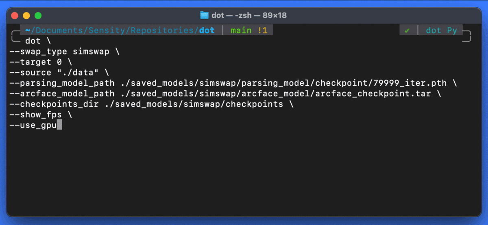

<div align="center">

<h1> the Deepfake Offensive Toolkit </h1>

[](https://github.com/sensity-ai/dot/stargazers)
[](https://github.com/sensity-ai/dot/blob/main/LICENSE)
[](https://www.python.org/downloads/release/python-3812/)
[](https://github.com/sensity-ai/dot/actions/workflows/build_dot.yaml)
[](https://github.com/sensity-ai/dot/actions/workflows/code_check.yaml)

<a href="https://colab.research.google.com/github/sensity-ai/dot/blob/main/notebooks/colab_demo.ipynb"></a>

</div>

*dot* (aka Deepfake Offensive Toolkit) makes real-time, controllable deepfakes ready for virtual cameras injection. *dot* is created for performing penetration testing against e.g. identity verification and video conferencing systems, for the use by security analysts, Red Team members, and biometrics researchers.

If you want to learn more about *dot* is used for penetration tests with deepfakes in the industry, read these articles by [The Verge](https://www.theverge.com/2022/5/18/23092964/deepfake-attack-facial-recognition-liveness-test-banks-sensity-report) and [Biometric Update](https://www.biometricupdate.com/202205/sensity-alleges-biometric-onboarding-providers-downplaying-deepfake-threat).

dot *is developed for research and demonstration purposes. As an end user, you have the responsibility to obey all applicable laws when using this program. Authors and contributing developers assume no liability and are not responsible for any misuse or damage caused by the use of this program.*

<p align="center">

</p>

## How it works

In a nutshell, *dot* works like this


All deepfakes supported by *dot* do not require additional training. They can be used
in real-time on the fly on a photo that becomes the target of face impersonation.
Supported methods:

- face swap (via [SimSwap](https://github.com/neuralchen/SimSwap)), at resolutions `224` and `512`
  - with the option of face superresolution (via [GPen](https://github.com/yangxy/GPEN)) at resolutions `256` and `512`
- lower quality face swap (via OpenCV)
- [FOMM](https://github.com/AliaksandrSiarohin/first-order-model), First Order Motion Model for image animation

## Running dot

### Graphical interface

#### GUI Installation

Download and run the dot executable for your OS:

- Windows (Tested on Windows 10 and 11):
  - Download `dot.zip` from [here](https://drive.google.com/file/d/10fdnSszaEbpGdCKxxeBFXQrkagxe3-RT/view), unzip it and then run `dot.exe`
- Ubuntu:
  - ToDo
- Mac (Tested on Apple M2 Sonoma 14.0):

  - Download `dot-m2.zip` from [here](https://drive.google.com/file/d/1KTRzQrl_AVpiFIxUxW_k2F5EsosJJ_1Y/view?usp=sharing) and unzip it
  - Open terminal and run `xattr -cr dot-executable.app` to remove any extended attributes
  - In case of camera reading error:
    - Right click and choose `Show Package Contents`
    - Execute `dot-executable` from `Contents/MacOS` folder

#### GUI Usage

Usage example:

1. Specify the source image in the field `source`.
2. Specify the camera id number in the field `target`. In most cases, `0` is the correct camera id.
3. Specify the config file in the field `config_file`. Select a default configuration from the dropdown list or use a custom file.
4. (Optional) Check the field `use_gpu` to use the GPU.
5. Click on the `RUN` button to start the deepfake.

For more information about each field, click on the menu `Help/Usage`.

Watch the following demo video for better understanding of the interface

<p align="center">

</p>

### Command Line

#### CLI Installation

##### Install Pre-requisites

- Linux

    ```bash
    sudo apt install ffmpeg cmake
    ```

- MacOS

    ```bash
    brew install ffmpeg cmake
    ```

- Windows

    1. Download and install Visual Studio Community from [here](https://visualstudio.microsoft.com/vs/community/)
    2. Install Desktop development with C++ from the Visual studio installer

##### Create Conda Environment

> The instructions assumes that you have Miniconda installed on your machine. If you don't, you can refer to this [link](https://docs.conda.io/projects/conda/en/latest/user-guide/install/index.html) for installation instructions.

###### With GPU Support

```bash
conda env create -f envs/environment-gpu.yaml
conda activate dot
```

Install the `torch` and `torchvision` dependencies based on the CUDA version installed on your machine:

- Install CUDA 11.8 from [link](https://developer.nvidia.com/cuda-11-8-0-download-archive)
- Install `cudatoolkit` from `conda`: `conda install cudatoolkit=<cuda_version_no>` (replace `<cuda_version_no>` with the version on your machine)
- Install `torch` and `torchvision` dependencies: `pip install torch==2.0.1+<cuda_tag> torchvision==0.15.2+<cuda_tag> torchaudio==2.0.2 --index-url https://download.pytorch.org/whl/cu118`, where `<cuda_tag>` is the CUDA tag defined by Pytorch. For example, `pip install torch==2.0.1+cu118 torchvision==0.15.2+cu118 torchaudio==2.0.2 --index-url https://download.pytorch.org/whl/cu118` for CUDA 11.8.

  Note: `torch1.9.0+cu111` can also be used.

To check that `torch` and `torchvision` are installed correctly, run the following command: `python -c "import torch; print(torch.cuda.is_available())"`. If the output is `True`, the dependencies are installed with CUDA support.

###### With MPS Support(Apple Silicon)

```bash
conda env create -f envs/environment-apple-m2.yaml
conda activate dot
```

To check that `torch` and `torchvision` are installed correctly, run the following command: `python -c "import torch; print(torch.backends.mps.is_available())"`. If the output is `True`, the dependencies are installed with Metal programming framework support.

###### With CPU Support (slow, not recommended)

```bash
conda env create -f envs/environment-cpu.yaml
conda activate dot
```

##### Install dot

```bash
pip install -e .
```

##### Download Models

- Download dot model checkpoints from [here](https://drive.google.com/file/d/1Qaf9hE62XSvgmxR43dfiwEPWWS_dXSCE/view?usp=sharing)
- Unzip the downloaded file in the root of this project

#### CLI Usage

Run `dot --help` to get a full list of available options.

1. Simswap

    ```bash
    dot -c ./configs/simswap.yaml --target 0 --source "./data" --use_gpu
    ```

2. SimSwapHQ

    ```bash
    dot -c ./configs/simswaphq.yaml --target 0 --source "./data" --use_gpu
    ```

3. FOMM

    ```bash
    dot -c ./configs/fomm.yaml --target 0 --source "./data" --use_gpu
    ```

4. FaceSwap CV2

    ```bash
    dot -c ./configs/faceswap_cv2.yaml --target 0 --source "./data" --use_gpu

    ```

**Note**: To enable face superresolution, use the flag `--gpen_type gpen_256` or `--gpen_type gpen_512`. To use *dot* on CPU (not recommended), do not pass the `--use_gpu` flag.

#### Controlling dot with CLI

> **Disclaimer**: We use the `SimSwap` technique for the following demonstration

Running *dot* via any of the above methods generates real-time Deepfake on the input video feed using source images from the `data/` folder.

<p align="center">

</p>

When running *dot* a list of available control options appear on the terminal window as shown above. You can toggle through and select different source images by pressing the associated control key.

Watch the following demo video for better understanding of the control options:

<p align="center">

</p>

## Docker

### Setting up docker

- Build the container

    ```
    docker-compose up --build -d
    ```

- Access the container

    ```
    docker-compose exec dot "/bin/bash"
    ```

### Connect docker to the webcam

#### Ubuntu

1. Build the container

    ```
    docker build -t dot -f Dockerfile .
    ```

2. Run the container

    ```
    docker run -ti --gpus all \
    -e NVIDIA_DRIVER_CAPABILITIES=compute,utility \
    -e NVIDIA_VISIBLE_DEVICES=all \
    -e PYTHONUNBUFFERED=1 \
    -v .:/dot \
    --runtime nvidia \
    --entrypoint /bin/bash \
    -p 8080:8080 \
    --device=/dev/video0:/dev/video0 \
    dot
    ```

#### Windows

1. Follow the instructions [here](https://medium.com/@jijupax/connect-the-webcam-to-docker-on-mac-or-windows-51d894c44468) under Windows to set up the webcam with docker.

2. Build the container

    ```
    docker build -t dot -f Dockerfile .
    ```
3. Run the container

    ```
    docker run -ti --gpus all \
    -e NVIDIA_DRIVER_CAPABILITIES=compute,utility \
    -e NVIDIA_VISIBLE_DEVICES=all \
    -e PYTHONUNBUFFERED=1 \
    -e DISPLAY=192.168.99.1:0 \
    -v .:/dot \
    --runtime nvidia \
    --entrypoint /bin/bash \
    -p 8080:8080 \
    --device=/dev/video0:/dev/video0 \
    -v /tmp/.X11-unix:/tmp/.X11-unix \
    dot
    ```

#### macOS

1. Follow the instructions [here](https://github.com/gzupark/boot2docker-webcam-mac/blob/master/README.md) to set up the webcam with docker.

2. Build the container

    ```
    docker build -t dot -f Dockerfile .
    ```
3. Run the container

    ```
    docker run -ti --gpus all \
    -e NVIDIA_DRIVER_CAPABILITIES=compute,utility \
    -e NVIDIA_VISIBLE_DEVICES=all \
    -e PYTHONUNBUFFERED=1 \
    -e DISPLAY=$IP:0 \
    -v .:/dot \
    --runtime nvidia \
    --entrypoint /bin/bash \
    -p 8080:8080 \
    --device=/dev/video0:/dev/video0 \
    -v /tmp/.X11-unix:/tmp/.X11-unix \
    dot
    ```

## Virtual Camera Injection

Instructions vary depending on your operating system.

### Windows

- Install [OBS Studio](https://obsproject.com/).

- Install [VirtualCam plugin](https://obsproject.com/forum/resources/obs-virtualcam.539/).

Choose `Install and register only 1 virtual camera`.

- Run OBS Studio.

- In the Sources section, press on Add button ("+" sign),

  select Windows Capture and press OK. In the appeared window,
  choose "[python.exe]: fomm" in Window drop-down menu and press OK.
  Then select Edit -> Transform -> Fit to screen.

- In OBS Studio, go to Tools -> VirtualCam. Check AutoStart,

  set Buffered Frames to 0 and press Start.

- Now `OBS-Camera` camera should be available in Zoom

  (or other videoconferencing software).

### Ubuntu

```bash
sudo apt update
sudo apt install v4l-utils v4l2loopback-dkms v4l2loopback-utils
sudo modprobe v4l2loopback devices=1 card_label="OBS Cam" exclusive_caps=1
v4l2-ctl --list-devices
sudo add-apt-repository ppa:obsproject/obs-studio
sudo apt install obs-studio
```

Open `OBS Studio` and check if `tools --> v4l2sink` exists.
If it doesn't follow these instructions:

```bash
mkdir -p ~/.config/obs-studio/plugins/v4l2sink/bin/64bit/
ln -s /usr/lib/obs-plugins/v4l2sink.so ~/.config/obs-studio/plugins/v4l2sink/bin/64bit/
```

Use the virtual camera with `OBS Studio`:

- Open `OBS Studio`
- Go to `tools --> v4l2sink`
- Select `/dev/video2` and `YUV420`
- Click on `start`
- Join a meeting and select `OBS Cam`

### MacOS

- Download and install OBS Studio for MacOS from [here](https://obsproject.com/)
- Open OBS and follow the first-time setup (you might be required to enable certain permissions in *System Preferences*)
- Run *dot* with `--use_cam` flag to enable camera feed
- Click the "+" button in the sources section → select "Windows Capture", create a new source and enter "OK" → select window with "python" included in the name and enter OK
- Click "Start Virtual Camera" button in the controls section
- Select "OBS Cam" as default camera in the video settings of the application target of the injection

## Run dot with an Android emulator

If you are performing a test against a mobile app, virtual cameras are much harder to inject. An alternative is to use mobile emulators and still resort to virtual camera injection.

- Run `dot`. Check [running dot](https://github.com/sensity-ai/dot#running-dot) for more information.

- Run `OBS Studio` and set up the virtual camera. Check [virtual-camera-injection](https://github.com/sensity-ai/dot#virtual-camera-injection) for more information.

- Download and Install [Genymotion](https://www.genymotion.com/download/).

- Open Genymotion and set up the Android emulator.

- Set up dot with the Android emulator:
  - Open the Android emulator.
  - Click on `camera` and select `OBS-Camera` as front and back cameras. A preview of the dot window should appear.
  In case there is no preview, restart `OBS` and the emulator and try again.
  If that didn't work, use a different virtual camera software like `e2eSoft VCam` or `ManyCam`.
  - `dot` deepfake output should be now the emulator's phone camera.

## Speed

### With GPU


Tested on a AMD Ryzen 5 2600 Six-Core Processor with one NVIDIA GeForce RTX 2070

```example
Simswap: FPS 13.0
Simswap + gpen 256: FPS 7.0
SimswapHQ: FPS 11.0
FOMM: FPS 31.0
```

### With Apple Silicon


Tested on Macbook Air M2 2022 16GB
```example
Simswap: FPS 3.2
Simswap + gpen 256: FPS 1.8
SimswapHQ: FPS 2.7
FOMM: FPS 2.0
```

## License

*This is not a commercial Sensity product, and it is distributed freely with no warranties*

The software is distributed under [BSD 3-Clause](LICENSE).
*dot* utilizes several open source libraries. If you use *dot*, make sure you agree with their
licenses too. In particular, this codebase is built on top of the following research projects:

- <https://github.com/AliaksandrSiarohin/first-order-model>
- <https://github.com/alievk/avatarify-python>
- <https://github.com/neuralchen/SimSwap>
- <https://github.com/yangxy/GPEN>

## Contributing

If you have ideas for improving *dot*, feel free to open relevant Issues and PRs. Please read [CONTRIBUTING.md](./CONTRIBUTING.md) before contributing to the repository.

## Maintainers

- [@ghassen1302](https://github.com/ghassen1302)
- [@vassilispapadop](https://github.com/vassilispapadop)
- [@giorgiop](https://github.com/giorgiop)
- [@AjinkyaIndulkar](https://github.com/AjinkyaIndulkar)
- [@kjod](https://github.com/kjod)

## Contributors

[](https://github.com/sensity-ai/dot/graphs/contributors)

<a href="https://github.com/sensity-ai/dot/graphs/contributors">
  
</a>

## Run `dot` on pre-recorded image and video files

- [Run *dot* on image and video files instead of camera feed](docs/run_without_camera.md)

## FAQ

- **`dot` is very slow and I can't run it in real time**

Make sure that you are running it on a GPU card by using the `--use_gpu` flag. CPU is not recommended.
If you still find it too slow it may be because you running it on an old GPU model, with less than 8GB of RAM.

- **Does `dot` only work with a webcam feed or also with a pre-recorded video?**

You can use `dot` on a pre-recorded video file by [these scripts](docs/run_without_camera.md) or try it directly on [Colab](https://colab.research.google.com/github/sensity-ai/dot/blob/main/notebooks/colab_demo.ipynb).
